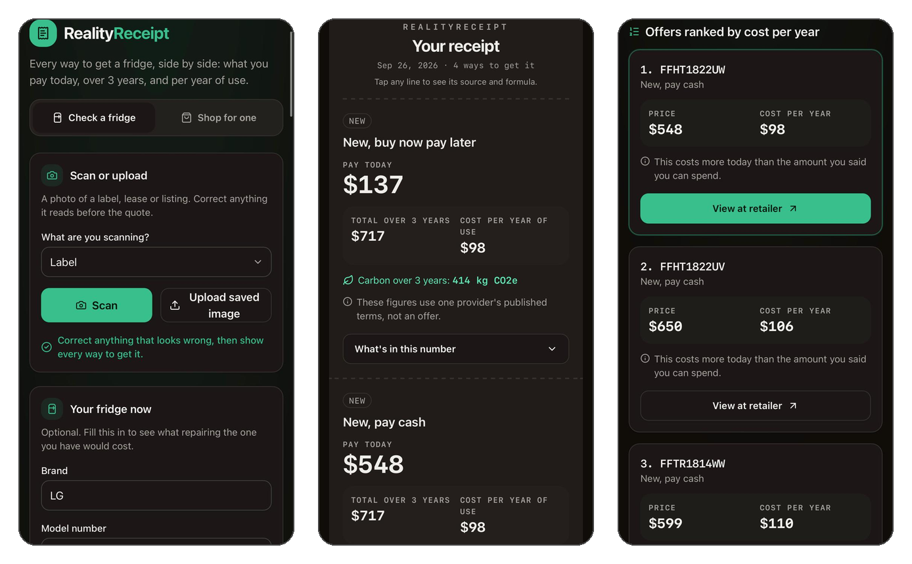
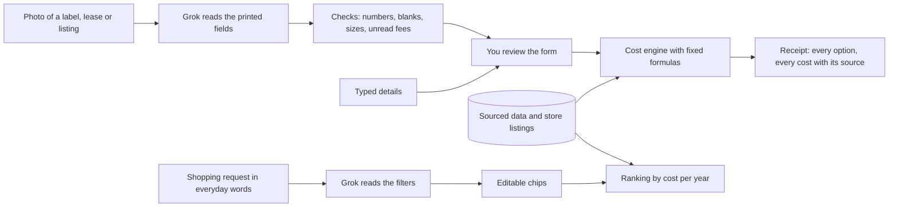

# RealityReceipt

RealityReceipt helps households on tight budgets compare the upfront and ongoing costs of appliances, including financing, rent-to-own, energy, and repairs, in one transparent receipt.

[](https://github.com/AaravChadha/realityreceipt/actions/workflows/ci.yml)

Built at HackGT 13 (Georgia Tech, September 25 to 27, 2026) for the Oracle of the Deep (ML/AI) track and the Aramco (A Marina's Mission) and SpaceXAI challenges.

[See it work](#see-it-work) · [What it does](#what-it-does) · [How it works](#how-it-works) · [Quick start](#quick-start) · [Sources and limits](#sources-and-limits) · [Team](#team)

## Who it is for

A price tag shows what you pay today. It leaves out the electricity, the interest, the lease terms, and how long the fridge will last. An older fridge may use more electricity, and financing and rent-to-own payments can add a lot to the purchase cost.

RealityReceipt is for someone choosing how to get a fridge on a tight budget, and for anyone who wants to check the math. Every number links to its source.

It is not a loan finder. The app asks nothing about income and never says whether a shopper qualifies for anything. Today it covers refrigerators only; cars are next (see [Roadmap](#roadmap)).

## See it work

<p align="center">
  
</p>
<p align="center"><sub>Enter or scan a fridge · The receipt: every way to get it, compared over time · Shop by cost per year, not by price</sub></p>

One of the demo cards is a real rent-to-own page from Aaron's. It offers a Frigidaire FRTE1936AV for $0.01 today. Given the lease's printed numbers, the app returned this on 2026-09-27:

| Option | Pay today | Total over 3 years |
|---|---|---|
| New, buy now pay later | $175.00 | $875.31 |
| New, pay cash | $699.99 | $875.31 |
| New, credit card | $0.00 | $962.16 |
| New, credit union PAL | $20.00 | $1,005.92 |
| Rent-to-own, keep paying | $0.01 | $1,915.20 |

The 3-year totals include electricity. The new options are the same fridge: the app matched the lease's model number to a store listing of that model, new at Best Buy for $699.99. The lease comes last because it costs the most over 3 years. Its first line shows where its numbers come from.

<details>
<summary>The lease line's formula</summary>

```
$0.01 today and $1,739.88 in all over 52 weeks, as printed on your lease; the remaining $1,739.87 is spread evenly over 51 weekly payments of about $34.11. Total of payments = $1,739.88. That is $542.89 more than the cash price of $1,196.99. No early purchase terms entered. Effective annual cost = ((1739.88 - 1196.99) / 1196.99) / (52 / 52) = 45%.
```

</details>

In the app, the same receipt appears as cards. Tap any cost to see its sources and formula.

<details>
<summary>Reproduce it with one command</summary>

Start the app (see the [Quick start](#quick-start)), then run:

```bash
curl -s http://localhost:8000/api/quote -H 'content-type: application/json' -d @- <<'EOF' | jq -r '.[] | [.name, .pay_today, .total_3yr_high] | @tsv'
{"items": [{"id": "lease", "category": "refrigerator", "brand": "Frigidaire", "model": "FRTE1936AV", "condition": "new"}],
 "offers": [{"item_id": "lease", "price": 1196.99, "seller_type": "rent_to_own", "source": "user_listing", "source_id": "user_listing"}],
 "lease": {"weekly_payment": 33.48, "term_weeks": 52, "cash_price": 1196.99, "payment_today": 0.01, "total_of_payments": 1739.88}}
EOF
```

</details>

## What it does

- **Enter what you have or found.** Type a fridge's brand and model, or take a photo of its rating label, a lease page, or a listing screenshot. There is no sign-up.
- **See every option side by side.** Keep the fridge you have, or repair it if you enter a repair quote. Buy used or refurbished from a listing you enter. Buy new with cash, a credit card, buy now pay later, or a credit union loan. Or rent-to-own, if you enter a lease.
- **Compare like with like.** The new fridge is the store listing most like yours: the same model family first, then the same type, then the closest size. Its line says which.
- **Three numbers per option:** what you pay today, the total over 3 years, and the cost per year of use. Totals are ranges from low to high.
- **Your budget, not a filter.** Say how much you can spend today, and the options that cost more are dimmed, not hidden.
- **A source for every cost.** Tap a cost to see its source, its formula, and whether it is **Rated**, **Published**, **You entered**, or **Not estimated**. A carbon line sits beside the cost.
- **Shop in everyday words.** Type "About $300, small space, need it this week". The app shows the filters it read as chips you can edit, then ranks store listings by cost per year, not by price. Each links to the store; nothing is bought in the app.

## How it works

AI extracts printed details. The calculation engine computes every total on the receipt.



- **Grok reads, the engine calculates.** Grok (xAI) turns a photo into typed fields and a shopping request into filters. Each reply is checked before use, and a scan that cannot be read falls back to the form. Every cost comes from a calculation engine with fixed formulas in [`api/app/engine/`](api/app/engine/), using datasets stored in the repository in [`api/app/data/`](api/app/data/).
- **The proof.** Our regression tests ([`api/tests/test_not_a_wrapper.py`](api/tests/test_not_a_wrapper.py)) replay Grok's recorded replies for each demo card and check that the scanned details and the same details typed by hand give identical receipts. On 2026-09-27, a live scan of each card through the running app matched its recording exactly. The app also works with no API key: typed entry never calls Grok.
- **Stack.** FastAPI and Pydantic (Python 3.12), React with Vite, TypeScript, Tailwind and shadcn/ui, Grok over the xAI API, pytest and Vitest, and GitHub Actions for CI.

## Quick start

Run these from the root of the checkout. You need Python 3.12 and Node 20.

```bash
python3 -m venv api/.venv
api/.venv/bin/pip install -r api/requirements.txt
npm --prefix web ci && npm --prefix web run build
api/.venv/bin/uvicorn app.main:app --app-dir api --port 8000
```

Open http://localhost:8000. The same server serves the app at `/` and the API under `/api`. After a new build, restart the server.

- **Scanning and the shopping page** need a Grok key. Copy `api/.env.example` to `api/.env` and fill in `XAI_API_KEY` and `XAI_MODEL`. The file is gitignored. Typed entry works without it.
- **On a phone.** Cameras need HTTPS, so open a free Cloudflare quick tunnel in a second terminal: `cloudflared tunnel --url http://localhost:8000`. Open the printed `https://` address on the phone.
- **While developing.** Run the web dev server with `npm --prefix web run dev` next to the API, and open http://localhost:5173. It forwards `/api/...` to port 8000.
- **Tests.** These are the checks CI runs on every pull request:

```bash
api/.venv/bin/python -m pytest api/tests analysis -q
npm --prefix web test
npm --prefix web run build
```

Troubleshooting and more ways to run are in [`docs/runbook.md`](docs/runbook.md). There is no hosted deployment; the demo runs on a laptop.

## Sources and limits

Every number comes from a source recorded ahead of time, or from something you entered. Nothing is fetched while the app runs, except Grok for scans and shopping requests.

| Source | What it supplies |
|---|---|
| Georgia Power, Residential Schedule R-31 and riders | The electricity price, $0.15641 per kWh |
| EPA ENERGY STAR, DOE's rating database, DOE standards (10 CFR 430.32) | How much electricity each model uses |
| EPA eGRID2023, SERC South | Carbon per kWh |
| Federal Reserve G.19 | Credit card interest, 22.15% |
| NCUA rules for credit union PALs | Loan caps: 28% interest, $20 fee, $2,000 |
| Afterpay | The buy now pay later schedule |
| NAHB life expectancy study (2007) | A fridge's typical life, 13 years |
| GE, Whirlpool and Electrolux date codes | The year made, read from the serial number |
| 17 store listings from Best Buy, The Home Depot and Lowe's | New prices, each with its URL and date |
| EIA Residential Energy Consumption Survey 2020 | The energy burden finding below |

When a cost has no source, the receipt leaves it blank and says **Not estimated** instead of guessing. The most important ones:

- The repair cost appears only when you enter a quote.
- Upkeep, sales tax, delivery and installation are not added.
- The extra electricity an old fridge uses as it ages is not modeled; its rating when new is used.
- The electricity price is held at today's tariff for all 3 years.
- Buy now pay later and credit union figures are published terms, not offers. Nobody is told they qualify.

The full list of sources, with links and the exact figures, and every limit with its reason, is in [`docs/sources-and-limits.md`](docs/sources-and-limits.md). The demo cards and where each came from are in [`demo/cards/README.md`](demo/cards/README.md).

## The energy burden finding

In 2020, households in the South Census region earning $20,000 to $24,999 spent 6.0% (renters) to 7.8% (owners) of their income on home energy. Households earning $100,000 to $149,999 spent 1.2% to 1.8%. These are our estimates from EIA's 2020 Residential Energy Consumption Survey microdata, using EIA's modeled energy costs, weighted by household, with 95% intervals from EIA's replicate weights. The analysis, its variables and its chart are in [`analysis/recs/`](analysis/recs/).

## Roadmap

- **Cars next.** Fuel from fueleconomy.gov and the Georgia gas price, oil changes and tires by mileage, Georgia's title tax, auto loans, and buy-here-pay-here lots through the same lease math. Insurance, major repairs and resale value would show as not estimated.
- **More appliances.** Dishwashers and washers first (their ratings work like a fridge's), then water heaters and room air conditioners.
- **More store listings,** so every kind of fridge has a close match.

The plan, with each task's acceptance check, is in [`PLAN.md`](PLAN.md). How the team worked is in [`AGENTS.md`](AGENTS.md).

## Team

- Aarav Chadha ([@AaravChadha](https://github.com/AaravChadha))
- Neil Sachdev ([@sachdevneil35-web](https://github.com/sachdevneil35-web))
- Krish Agrawal ([@KrishAgrawal595](https://github.com/KrishAgrawal595))
- Adhyayan Agarwal ([@adhyayancs50](https://github.com/adhyayancs50))
